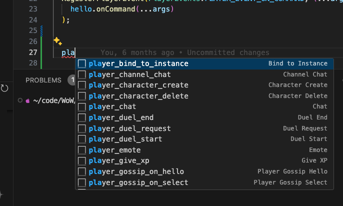

# VSCode Integration

ETS-Cli offers integration with VSCode through snippets, making it easier to develop modules by providing templates for common patterns around event hooks.  

The format of the snippets follows this convention:
```
[object name]_(event_name)  // creature_on_...  or player_on_...
```

## Installing Snippets

Run the following command in your project directory:
```bash
npx ets snippets
```

#### Here is a visual example of how snippets work inside of VScode for this project. 

